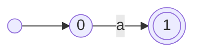
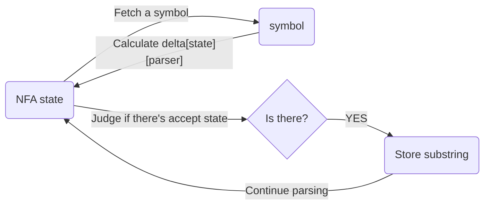
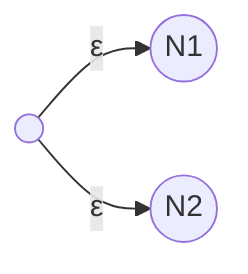
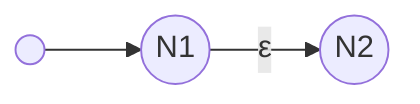
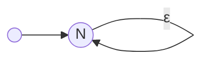

## A Simple Example

First, let's take a look at an easy regex example from [LeetCode](https://leetcode.com/problems/regular-expression-matching/description/).

> Given an input string s and a pattern p, implement regular expression matching with support for '.', '*' and:
- '.' Matches any single character.​​
- '*' Matches zero or more of the preceding element.
- The matching should cover the entire input string (not partial).

As we discussed in [A Deeper Understanding of Regular Expression](https://ssase.github.io/posts/a-deeper-understanding-of-regular-expression/), in order to get selected substring with the pattern from the string, we should construct an *NFA* first.

## Implement An Easiest *NFA* With C++

The easiest *NFA* may be like below:



It has 2 states, and accepts `a`. So, it can be defined as a 5-tuple $(Q, \Sigma, \delta, q_0, F)$, and:
1. $Q = \{0, 1\}$
2. $\Sigma = \{a \ |\ a \in ASCII\}
$
3. $\delta$ can be described as

||a|other symbols|
|---|---|---|
|$0$|$\{1\}$|$\varnothing$|
|$1$|$\varnothing$|$\varnothing$|

4. $q_0 = \{0\}$
5. $F = \{1\}$

Now, we can define a class `NFA` as below:

```c++
typedef unsigned int NFAState;
typedef unsigned int NFASymbol;
typedef pair<unsigned int, unsigned int> Substring; // pair.first means the position of string head, and pair.second means the length of string

class NFA
{

private:
    NFAState Q; // Due to all the states are numbers, we can use the count of states to represent all possible states, and the range is 0-(Q-1).
    vector<unordered_map<NFASymbol, unordered_set<NFAState>>> delta; // The transition function running like this: nextStates = delta[currentState][receivedSymbol], user should use receive() instead
    NFAState startState; // Normaly 0
    unordered_set<NFAState> acceptStates;

    const unordered_set<NFAState> receive(const NFAState currentState, const NFASymbol symbol);
    bool isStartState(const NFAState state);
    bool isAcceptState(const NFAState state);
    bool containAcceptStates(const unordered_set<NFAState>& states);

    unordered_set<NFAState> collectEmptyCharReachableStates(unordered_set<NFAState> states);

public:
    static const NFASymbol EPSILON; // To indicate an empty symbol.

    NFA(const NFAState Q, const NFAState startState, const unordered_set<NFAState> acceptStates, vector<unordered_map<NFASymbol, unordered_set<NFAState>>> delta): Q(Q), startState(startState), acceptStates(acceptStates), delta(delta){}

    vector<Substring> parseString(const string& str);
};
```

Its methods are easy to implement:
```c++
const unordered_set<NFAState> NFA::receive(const NFAState currentState, const NFASymbol symbol)
{
    // Don't forget some unregular situations
    if (delta.size() > currentState && delta[currentState].contains(symbol)) {
        return delta[currentState][symbol];
    }
    return {};
}

bool NFA::isStartState(int state)
{
    return startState == state;
}

bool NFA::isAcceptState(int state)
{
    return acceptStates.contains(state);
}

bool NFA::isStartState(NFAState state)
{
    return startState == state;
}

bool NFA::isAcceptState(NFAState state)
{
    return acceptStates.contains(state);
}

bool NFA::containAcceptStates(const unordered_set<NFAState>& states)
{
    bool containAcceptStates = false;
    for (const auto& state: acceptStates) {
        if (states.contains(state)) {
            containAcceptStates = true;
            break;
        }
    }
    return containAcceptStates;
}

const NFASymbol NFA::EPSILON = -1; // We use it as an ε which means empty symbol in an NFA.
```

Except `parseString` method, it is a little difficult. We can describe what we should do as below first:



Then, we can have the implementation:
```c++
vector<Substring> NFA::parseString(const string& str)
{
    const unsigned int NothingMatched = -1;

    // `pair.first` means the first location of matched substring in the string, and `pair.second` means the length.
    // `result` stores all matched substring,
    vector<Substring> result;
    // and `matchedSubstring` stores substring that is being analysed.
    pair<string::const_iterator, unsigned int> matchedSubstring{str.begin(), NothingMatched};

    unordered_set<NFAState> deltaResult;

    // Although there is only one start state, but we should also consider ε(aka empty string), this will store the start states after considering empty string reachability.
    unordered_set<NFAState> startStates{startState};

    // Before the parsing, the NFA's states
    unordered_set<NFAState> parsingStartStates;
    // During parsing, we need to store the result states as splited NFAs.
    unordered_set<NFAState> splitedNFAStates;

    // And also, we need to store result states before finishing calculating states in splitedNFAStates.
    unordered_set<NFAState> tempStates;
    unordered_set<NFAState> emptyReachableStates;

    // Follow the symbol under analysed.
    string::const_iterator parser = str.begin();

    // Calculate startStates
    emptyReachableStates = collectEmptyCharReachableStates(startStates);
    startStates.insert(emptyReachableStates.begin(), emptyReachableStates.end());
    // To find out if the NFA accepts empty string.
    if (containAcceptStates(startStates)) {
        matchedSubstring.second = 0;
    }

    parsingStartStates = startStates;

    while (parser < str.end()) {

        for (const auto& state : parsingStartStates) {
            deltaResult = receive(state, *parser);
            tempStates.insert(deltaResult.begin(), deltaResult.end());
        }
        emptyReachableStates = collectEmptyCharReachableStates(tempStates);
        tempStates.insert(emptyReachableStates.begin(), emptyReachableStates.end());
        splitedNFAStates = tempStates;

        // Clear after used.
        tempStates.clear();

        if (splitedNFAStates.empty()) {

            if (parsingStartStates == startStates) {
                parser++;

            } else {
                if (matchedSubstring.second != NothingMatched) {
                    result.push_back({(NFAState)(matchedSubstring.first - str.begin()), matchedSubstring.second});
                }
                parsingStartStates = startStates;
            }

            matchedSubstring = {parser, NothingMatched};

        } else {

            parser++;
            parsingStartStates = splitedNFAStates;

            if (containAcceptStates(splitedNFAStates)) {
                matchedSubstring.second = (NFAState)(parser - matchedSubstring.first);
            }
        }
    }

    if (matchedSubstring.second != NothingMatched) {
        result.push_back({(NFAState)(matchedSubstring.first - str.begin()), matchedSubstring.second});
    }

    return result;
}
```

In addition, we need `collectEmptyCharReachableStates` to collect all states which are reachable through an ε.
```c++
unordered_set<NFAState> NFA::collectEmptyCharReachableStates(unordered_set<NFAState> states)
{
    unordered_set<NFAState> result;
    unordered_set<NFAState> temp;

    while (!states.empty()) {
        auto header = states.begin();
        while (header != states.end()) {
            const unordered_set<NFAState> tempResult = receive(*header, EPSILON);
            temp.insert(tempResult.begin(), tempResult.end());
            header++;
        }
        states = temp;
        temp.clear();
        result.insert(states.begin(), states.end());
    }

    return result;
}
```

And now, we can use it to locate `a` from string:
```c++
NFA n = NFA(2, 0, {1}, {
    { {'a', {1}} },
    {},
});
vector<Substring> res = n.parseString(s);
```

## Add Operations to *NFA*

According to the theory of regex we discussed before, we still need 3 operations: **union**, **concatenation**, **star**

### Add Union

Union is like this



So, we can implement it as below:

```c++
void makeUnion(const NFA& n);

void NFA::makeUnion(const NFA& n)
{
    if (n.Q == 0) { return;}
    if (Q == 0) {
        *this = n;
        return;
    }

    startState = 0;

    unordered_set<NFAState> newAcceptStates;
    for (const auto& state: acceptStates) {
        newAcceptStates.insert(state + 1);
    }
    for (const auto& state: n.acceptStates) {
        newAcceptStates.insert(state + 1 + Q);
    }
    acceptStates = newAcceptStates;

    vector<unordered_map<NFASymbol, unordered_set<NFAState>>> newDelta;
    unordered_map<NFASymbol, unordered_set<NFAState>> tempMap;
    unordered_set<NFAState> tempSet;
    newDelta.push_back({ {EPSILON, {startState + 1, n.startState + 1 + Q}} });

    const vector<unordered_map<NFASymbol, unordered_set<NFAState>>> * deltas[] = {&delta, &n.delta};
    const NFAState addons[] = {1, Q + 1};
    for (int i = 0; i < 2; i++) {
        for (const auto& map : *(deltas[i])) {
            for (const auto& pair : map) {
                for (const auto& state : pair.second) {
                    tempSet.insert(state + addons[i]);
                }
                tempMap[pair.first] = tempSet;
                tempSet.clear();
            }
            newDelta.push_back(tempMap);
            tempMap.clear();
        }
    }
    delta = newDelta;

    Q += n.Q + 1;
}
```

### Add Concatenation

Concatenation is like this:



And, it can be imlemented as below:

```c++
void makeConcatenation(const NFA& n);

void NFA::makeConcatenation(const NFA& n)
{
    if (n.Q == 0) { return;}
    if (Q == 0) {
        *this = n;
        return;
    }

    for (const auto& state: acceptStates) {
        delta[state][EPSILON].insert(n.startState + Q);
    }
    unordered_map<NFASymbol, unordered_set<NFAState>> tempMap;
    unordered_set<NFAState> tempSet;
    for (const auto& map : n.delta) {
        for (const auto& pair : map) {
            for (const auto& state : pair.second) {
                tempSet.insert(state + Q);
            }
            tempMap[pair.first] = tempSet;
            tempSet.clear();
        }
        delta.push_back(tempMap);
        tempMap.clear();
    }

    unordered_set<NFAState> newAcceptStates;
    for (const auto& state: n.acceptStates) {
        newAcceptStates.insert(state + Q);
    }
    acceptStates = newAcceptStates;

    Q += n.Q;
}
```

### Add Star

Star is like this:



And we can implement it as below:

```c++
void makeStar(void);

void NFA::makeStar(void)
{
    if (Q == 0) { return; }

    for (const auto& state: acceptStates) {
        delta[state][EPSILON].insert(startState);
    }
    acceptStates = {startState};
}
```

Now, we can add another constructors to NFA for convenience:

```c++
NFA(): NFA(0, 0, {}, {}){}
NFA(const NFASymbol specialSymbol);
NFA(const string pattern); // Init an NFA with a simple regex

NFA::NFA(const NFASymbol specialSymbol)
{
    if ((specialSymbol >= 'a' && specialSymbol <= 'z') || (specialSymbol >= 'A' && specialSymbol <= 'Z')) {
        Q = 2;
        startState = 0;
        acceptStates = {1};
        delta = {
            { {specialSymbol, {1}} },
            {}
        };
    } else if (specialSymbol == '.') {
        Q = 2;
        startState = 0;
        acceptStates = {1};
        delta = {
            {},
            {}
        };
        for (char c = 'a'; c <= 'z'; c++) {
            delta[0][c] = {1};
        }
    } else {
        Q = 0;
        startState = 0;
        acceptStates = {};
        delta = {};
    }
}

NFA::NFA(const string pattern)
{
    *this = NFA{};
    NFA n1;
    NFA m{'.'};

    char t = '*';

    for (auto i = pattern.begin(); i <= pattern.end(); i++) {

        if (t != '*') {

            if (t == '.') {
                n1 = m;

            } else {

                n1 = NFA(2, 0, {1}, {
                    { {t, {1}} },
                    {},
                });
            }

            if (*i == '*') {
                n1.makeStar();
            }

            this->makeConcatenation(n1);
        }

        t = *i;
    }
}
```

## Finish The Example

Finally, we get the answer:

```c++
class Solution {
public:
    bool isMatch(string s, string p) {

        NFA n = NFA(p);
        vector<Substring> res = n.parseString(s);

        return !res.empty() && res[0].second == s.size();
    }
};
```

You can get the whole codes [here](https://github.com/ssase/regex).

## What Else Do We Need

As we can see, the more complex *NFA* we construct using operations, the more redundant states it may have. So the most important action we need to take is to figure out a way to **simplify the *NFA***.

And also, we have just implemented a simple regex, we still need to make the `NFA(string pattern)` **recoginze more complicated regex** like this `[\w.%+-]+@[\w.-]+\.[a-zA-Z]+`.

Of course, we will do these in the future.

Have a nice day!